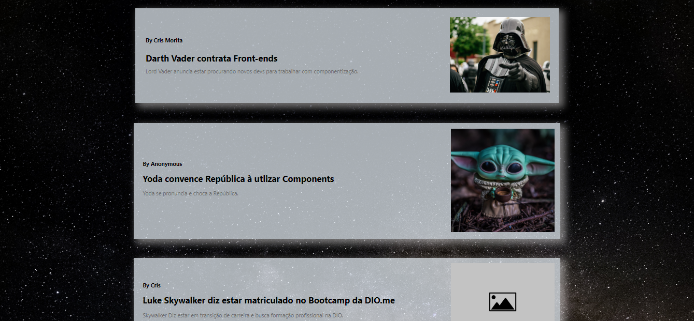

# Primeiro Componente Com JavaScript 🤖
Criando meu primeiro componente com JavaScript, nesse caso, uma tag '<card-news>' para facilitar a criação de um blog de notícias:

## 📝 O que é necessário saber:

> DOM - Document Object Model  
    É a representação de dados dos objetos que compõem a estrutura e o conteúdo de um documento na Web, tem formato de árvore.

> Shadow DOM  
    É um anexo ao DOM complementado pelo HTML, o qual podemos manipular, além de fornecer uma maneira de definir o escopo de estilos CSS para essa subárvore DOM específica e isolar essa subárvore do resto do documento.

> Component  
    É basicamente um conjunto de elementos ou um conjunto de tecnologias diferentes que permite criar elementos personalizados reutilizáveis com sua funcionalidade encapsulada do restante do código assim podendo ser utilizada em vários projetos.

## 🎮 Tecnoligias utilizadas:

    - HTML
    - CSS
    - JavaScript
    - Git e Github

### 💌 Agradecimentos

À toda equipe da DIO e da NTT Data pela oportunidade de adiquirir tanto conhecimento e imergir no mundo tecnológico, e principalmente ao Felipe Aguiar, que dividiu seu conhecimento de forma lúdica e de fácil entendimento. Obrigada por facilitar os estudos e tornar mais leve e divertido! Então... bora codar!! 